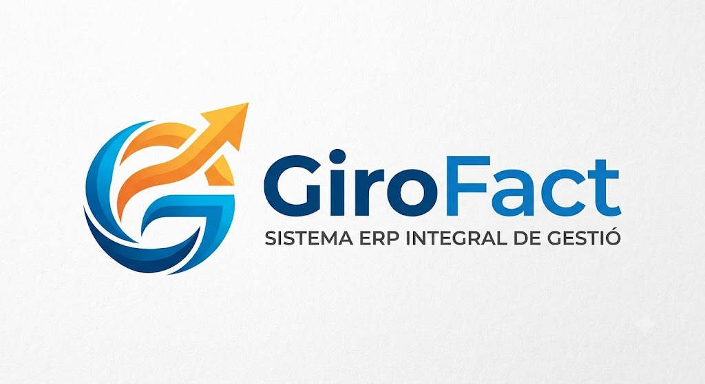

 

# GIROFAC — Comprehensive Web ERP Platform

GIROFAC is an all-in-one web ERP platform designed for comprehensive business management built on a modular and scalable architecture. The project is initially deployed under a local development environment based on the **LAMP/XAMPP** stack (Linux/Windows, Apache, MariaDB/MySQL, PHP 8.x), designed using decoupled development patterns that ensure an immediate transition to cloud infrastructures (VPS, PaaS, or containerized environments) without code refactoring.

The interface follows **Mobile-First** principles and responsive design, ensuring seamless accessibility from any device and enforcing Role-Based Access Control (**RBAC**) that adapts the user experience and module visibility in real time.

** 01/07/2026: Project in development **
---

## System Modules

### 1. System, Configuration & Access Control
* **Business & Tax Setup:** Centralizes tax settings, multi-language environments (CA, ES, EN), direct/indirect tax structures (VAT/TAX), and sequential invoice series.
* **Authentication & RBAC:** Evaluates real-time permission matrices to dynamically enable or restrict CRUD actions based on user roles.
* **Audit Logging & Traceability:** Centralized logging subsystem recording critical system operations (logins, sensitive data edits, financial transactions).

### 2. Commercial Management & CRM
* **Unified Client Management:** Centralizes fiscal and operational client history for a 360° business overview.
* **Sales Pipeline & Direct Conversion:** Structured quotes with automated tax calculations and one-click conversion into invoices or active projects.
* **Recurring Contracts & Subscriptions:** Automated scheduled billing for recurring service models.
* **Electronic Signature Verification:** Captures client signatures on mobile or web interfaces with complete audit trails (IP, date, and timestamp).

### 3. Operations, Projects & Technical Support
* **Project Management (PM):** Organizes work into projects and tasks linked to clients, complete with milestones and resource allocation.
* **Time Tracking & Timesheets:** Logs billable and non-billable hours with real-time profitability analytics (internal cost vs. sell rate).
* **Helpdesk & Ticket Management:** Centralizes client support requests; resolution time integrates directly into project timesheets.
* **Knowledge Management:** Internal technical library for procedures and technical documentation.
* **Hourly Billing Workflow:** Seamless flow (`Client` ➔ `Project` ➔ `Timesheets`) consolidating unbilled hours directly into customer invoices.

### 4. Accounting & Financial Management
* **Direct & Derived Invoicing:** Manages incoming and outgoing invoices ensuring strict compliance with sequential numbering and tax rules.
* **Operating & Payroll Expense Management:** Categorizes corporate expenses and assigns them directly to project costs to calculate net margins.
* **Automated Bank Reconciliation:** Matches bank statements with outstanding invoices and expense settlements.
* **Financial & Tax Reporting:** Consolidates invoice registers and computes preliminary tax returns (VAT, withholdings).

### 5. Logistics, Inventory & Vendor Management
* **Vendor Management & Catalog:** Vendor pricing, purchasing details, and product tracking using SKU codes and financial parameters (Cost vs. MSRP).
* **Real-Time Inventory Control:** Monitors stock levels with automated low-stock alerts.
* **Automated Stock Movements:** Automatically decrements stock upon invoice issuance and increments stock upon purchase order confirmations.

### 6. Human Resources & Time Tracking
* **Time & Attendance Tracking:** Daily work shift logging (clock-in, clock-out, breaks) for labor compliance.
* **Leave & Absence Planning:** Shift scheduling, holiday requests, and sick leave management.
* **Cost-per-Hour Analytics:** Links employee cost rates with project timesheets to analyze true operational profitability.

### 7. Marketing, Communication & Shared Calendar
* **Email Marketing & Dynamic Templates:** Mass communication tools with automated business notifications.
* **Social Media Management:** Interactive calendar for editorial content planning.
* **Unified Agenda:** Combines commercial meetings, project milestones, and marketing events into a single view.
* **Dynamic Database Segmentation:** CRM data-driven audience filtering based on customer behavior and contract history.

---

## Global Data Architecture & Integration

GIROFAC's core value lies in the **native interconnection** of all operational modules, preventing data silos:
1. The **CRM** pipeline converts deals directly into active projects (**Operations**) or invoicing commitments.
2. **Operations** tracks costs in real time using **HR** parameters and pushes billable hours to **Finance**.
3. Purchasing and sales keep **Inventory** and cash flow synchronized, wrapping up the cycle with automated **Bank Reconciliation**.
